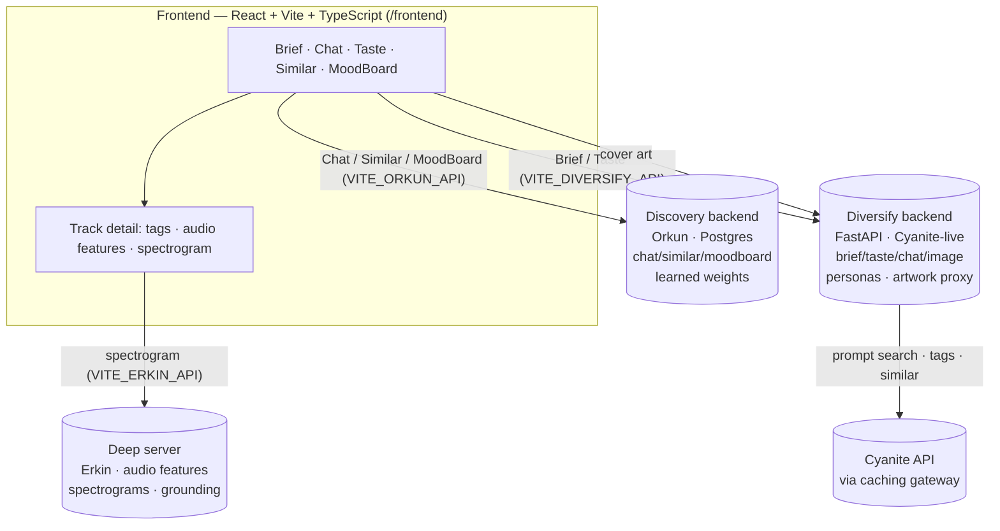

# Architecture

Diversify is one React frontend over a **hybrid** of three backends. Cyanite is the
recommendation engine; a self-built audio layer validates and extends it but never replaces it
as the recommender. The frontend routes each feature to the backend that owns it.

## System diagram

## Request flow per tab

| Tab | Frontend call | Backend | Notes |
|---|---|---|---|
| Brief | `POST /api/brief` | Diversify | Gemini decompose → Cyanite search → persona rerank; cached |
| Chat | `POST /api/chat` | Discovery | conversation → tag filter → learned-weight ranking |
| Taste | `GET /api/listener/{n}` + `POST …/stream` | Diversify | named listener → multi-track similarity, steerable |
| Similar | `POST /api/similar-file` | Discovery | audio upload → pgvector/NCD acoustic KNN |
| MoodBoard | `POST /api/multimodal` | Discovery | Gemini Vision → Cyanite filter → results |
| Track detail | `GET /api/track/{id}` + spectrogram | Discovery + Deep | tags/features from Discovery, spectrogram PNG from Deep |
| Cover art | `GET /api/artwork/{jid}` | Diversify | server-side Jamendo lookup (avoids browser CORS) |

## Frontend module map (single source of truth)

| Concern | One place |
|---|---|
| Diversify-backend calls (Brief/Taste/artwork) | `src/apiDiversify.ts` |
| Discovery-backend calls (Chat/Similar/MoodBoard/detail) | `src/api.ts` |
| Cover-art fetch + cache | `src/art.ts` |
| App shell, nav, hash routing, tooltips | `src/App.tsx` |
| Pages | `src/pages/*` (BriefPage, ChatPage, DiversifyTastePage, SimilarPage, MoodBoardPage) |
| Shared track row (Brief/Taste) | `src/components/DvTrackRow.tsx` |
| Track card + detail modal (Discovery tabs) | `src/components/TrackCard.tsx`, `TrackModal.tsx` |
| Taste visualization | `src/components/DvTasteCard.tsx` (Recharts) |

Every backend URL is a build-time env var with a default (see README), so the same build runs
locally or on the team server by changing env, not code.

## Why three backends instead of one

Each was built independently and already works; rewriting them into one would cost more than it
buys for a hackathon. The frontend is the integration layer — it knows which service owns which
feature. The trade-off: the app depends on all three being reachable (the discovery + deep
servers are deployed; the Diversify backend is deployed alongside them — see DEPLOY.md).
